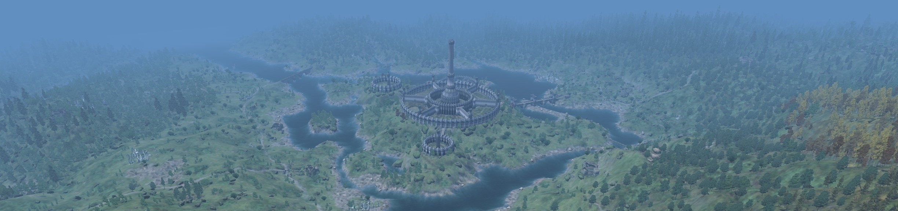

slowLODGen is a TES 4: Oblivion tool that generates merged object LOD meshes that don't kill your performance. It replaces the good old TES4LODGen, offering a fully automated, (almost) one-click solution.

_This screenshot was taken at 172fps_

## **Key Features**
**Significant performance gains.** slowLODGen merges LOD meshes per every cell, drastically reducing the number of drawcalls, which leads to significantly higher FPS (up to ~3x in some test scenarios compared to TES4LODGen at cost of 100-300MB RAM consumption -- refer to the Benchmarks section).

**Easy to use.** Installation and usage are incredibly simple — just double-click a .bat file, and the tool does the rest.

**Fully compatible.** Works with all mod setups and LOD packs, though for the best results it is recommended to use atlassed LOD packs.

>[!WARNING]
>**If you don't want to read instructions, at least read this: LOAD ORDER IS EXTREMELY IMPORTANT. Oblivion LOD system relies on full FormIDs of base objects for LOD objects. As base objects for merged meshes are defined in MergedLOD.esm, it is essential that you don't change its load order position after generation and ensure that its load order matches the load order stated in the description.**

Discord for support: https://discord.gg/77tgjpvGZ3

## **Requirements**

As with TES4LODGen, the tool needs _far object meshes to run. The list of recommended VWD packs is provided below. Additionally, bsa packing function requires having [SkyBSA](https://www.nexusmods.com/oblivion/mods/49568) installed.

### **Recommended LOD packs**
The tool merges shapes across similar materials, so you want to use atlassed VWD packs. These 3 provide a good foundation for your LOD.

[J3 Atlassed VWD2](https://www.nexusmods.com/oblivion/mods/51732) - use Performance preset as a starting point and see if you are happy with performance

[Optimized VWD](https://www.nexusmods.com/oblivion/mods/49595)

[VWD for Town Houses](https://www.nexusmods.com/oblivion/mods/50073)

Also, good news for [Better Cities](https://www.nexusmods.com/oblivion/mods/16513?tab=posts) users: meshes provided by the mod are atlassed.

## **Installation\Usage**

#### Wrye Bash or any other setup without a virtual FS
1. Unpack the archive somewhere on your computer.
2. Double-click on Launch `slowLODGen.bat` and wait for the tool to finish (depending on your setup can take 5-15 minutes)
3. Check in your mod manager that the load order position of MergedLOD.esm matches the position stated in the esp description; if not, move it

#### Using non-standard (not matching the record in Windows registry) Oblivion directories (or several local installs)
1. Unpack the archive somewhere on your computer.
2. Open LODGen_config.yaml with any text editor (e.g. Notepad)
3. Set path to your Data folder in the field `game_folder`. Note that you have to use double slashes in the path. Example: `game_folder: "C:\\Games\\Oblivion\\Data"`
4. If you use local Oblivion.ini setup (you know if you do), set the path to Plugins.txt file in `plugins_txt_path` field. Use double slashes: `plugins_txt_path: "C:\\Games\\Oblivion\\plugins.txt"`
5. Double-click on Launch slowLODGen.bat and wait for the tool to finish (depending on your setup can take 5-15 minutes)
6. Check in your mod manager that the load order position of MergedLOD.esm matches the position stated in the esp description; if not, move it

#### MO2
1. Unpack the archive somewhere on your computer.
2. If you use a non-standard Oblivion directory, refer to the previous section for paths.
3. Open LODGen_config.yaml with any text editor (e.g. Notepad) and set `write_bsa` to `write_bsa: True` (note that SkyBSA is required).
4. Add `slowLODGen.bat` as an executable (Tools -> Executables... -> "+" -> "Add from file..."). 
5. Run the bat through **MO2** (select "Launch slowLODGen" in the list in the right pane and press the giant "Run" button)
6. Wait for the tool to finish (depending on your setup can take 5-15 minutes)
7. Check in the right pane that the load order position (right pane, `"Mod Index" column`) of MergedLOD.esm matches the load order position stated in the esp description (shown when yuou hover over the plugin) and that the file is active.
8. Check that MergedLOD.esp is active and that it is loaded late in the load order.

#### Regenerating *.lod files without remerging the meshes
If you need to quickly update your *.lod files (for instance, because of some small load order changes or if you need to move the esm somewhere else), you can set `skip_mesh_generation: True` in LODGen_config.yaml. In this case, your merged meshes will be reused. 

## **FAQ**

**OH NO MY LOD IS GONE**

Re-read the instructions. Go into Wrye Bash or any other mod manager and check that the position of MergedLOD.esm matches the position stated in the description. If you use the bsa packing feature, check that MergedLOD.esp is active.

**I don't see any improvements in performance; how can I ensure that the script has worked correctly?**

Disable MergedLOD.esm and load into the game: if your LOD has disappeared, then the script has worked correctly and either you have some other performance bottleneck (for instance, you are GPU-bounded because of 400 ENBs slapped on top running on an integrated GPU), or you predominantly use non-atlassed shapes that don’t merge well.

**There are a lot of errors during mesh generation, is it bad?**

Usually not, especially during mesh generation. Unfortunately, the quality of mod meshes for Oblivion is *not that good*, so these messages serve as a useful datapoint if you actually run into some issues and have to debug them. That said, if you experience any issues with meshes that result in visual problems, feel free to report them to us. Additionally, if there are error like “can’t open a NIF file, not a NIF file”, first try opening it in Nifskope, if you can’t – write to the NIF mod author, it is not our responsibility to create workaround for completely broken meshes.

**I get tons of warnings about HITMEs and duplicated IDs for my mods.**

Not a problem for this tool, but you really need to reconsider using these mods on your setup for general potential stability issues so that's why the tool throws warnings.

**Can I get rid of the esm/esp? Can I merge them? I need to install all Ilovekyciliazabi's so I need esp slots.**

ESM you can’t merge (unless you are ready to write a binary patcher for the .lod files). Esp is a bit trickier. First, you don't need the esp if you don't use the bsa as it is only used for bsa loading. Second, you can load the bsa with any other esp, though I highly recommend this esp to be late in the load order as there are known instances of mods packing their own \*.lod files (or some mods like Hackdirt Alive packing .lod files for the author's setup for locations completely unrelated to Hackdirt, so you end up with seeing flying towers in Jeral Mountains).

**The script immediately crashes with some sort of “found unknown escape character" or "no such directory" error.**

If you changed something in the config file, read carefully the description of the settings. You need to use double slashes "\\" for all paths in the config. Also, make sure that you provided the correct paths, path to the Data folder and full path to plugins.txt – the examples are provided in the config.

**I don't like atlassed LOD packs because they do not have AWLS features, can I use RAEVWD :lizard:?**

You can, performance will be much worse.

**Why the need for an esm in the first place?**

Mostly to reduce the number of user reports claiming that their LOD is gone and reduce the maintenance time for users who change their LO often. .lod files save the information about object's base load-order dependent FormID – that means that any changes in MergedLOD.esm LO will break LOD. If it is placed very high in the LO, there is a little chance that any other LO changes would move the file.

**Why can't you provide a single exe executable like Wrye Bash?**

No real need to. Also, we use PyPy instead of CPython as it is 2-3x times faster for that particular script – popular and stable exe packing tools do not support PyPy.

**I don't like using some random bundled binaries, can I just run it on my python instance?**

Yes, all dependencies are installable from PyPI.

## **Benchmarks**

### Lightly-modded game

**Hardware:** Ryzen 3600, RTX 2060
**Modlist:** [ROTS guide](https://docs.google.com/document/d/1FX-Zripwp-DG7lIxsOIU3byYw-dg_iZVnaEUokHgmo8/edit) - heavy texture packs, light impact from scripts and new objects, ORC from performance optimizations and LOD culling
First of all, more or less "realistic" 3-minute flight around the Imperial Isle with [Benchmark](https://www.nexusmods.com/oblivion/mods/52873). This test allows to test the performance in a gameplayish environment in a FPS-intensive area with a lot of loading stutter and impact from NPCs and clutter.

What is the reason for such an increase? Draw calls. The less separate shapes the CPU has to process, the higher is FPS. GPU utilization (or how much work your CPU managed to give to the GPU) explains 98% of variance of FPS between tests:

No free lunch though. The game has to keep unique LOD nifs in memory, increasing RAM consumption. Not an issue in this case, as we are not close even to the 32bit 1.6GB limit, but depending on your setup (you don't use heavy retextures without OR/ENBoost memory patch, right?) this might be a consideration. 

