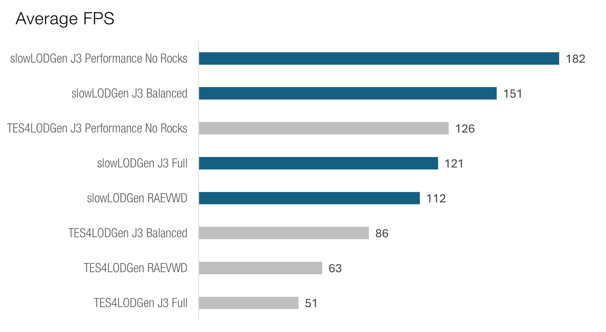

slowLODGen is a TES 4: Oblivion tool that generates merged object LOD meshes without killing your performance. It replaces the good old TES4LODGen, offering a fully automated, (almost) one-click solution.

_Screenshot taken at 172fps. Hi, TES4LODGen!_


## **Key Features**
**Major performance gains.** slowLODGen merges LOD meshes cell-by-cell, drastically reducing draw calls and boosting FPS by up to 3x compared to TES4LODGen (The trade-off? 100–300 MB extra RAM usage—see Benchmarks).

**Simple to use.** Installation is easy — just unpack, double-click a .bat file, and the slowLODGen handles the rest.

**Compatiblity and happiness.** Works seamlessly with all mod setups and LOD packs. For best results, atlassed LOD packs are recommended.

>[!WARNING]
>**PSA for Readme Skimmers: LOAD ORDER IS EXTREMELY IMPORTANT. Oblivion's LOD system relies on full base objects FormIDs. Make sure MergedLOD.esm’s load order remains the same after generation, matching the load order stated in the esm description.**

[Support Discord](https://discord.gg/77tgjpvGZ3)

## **Requirements**

Like TES4LODGen, the tool requires _far object meshes. A list of recommended VWD packs is provided below. Additionally, BSA packing functionality requires [SkyBSA](https://www.nexusmods.com/oblivion/mods/49568).

### **Recommended LOD packs**
The tool merges shapes across similar materials, so for best results, opt for atlassed VWD packs. Here are three solid options to form the foundation for your LOD:

[J3 Atlassed VWD2](https://www.nexusmods.com/oblivion/mods/51732) - use Performance preset as a starting point and see if you are happy with performance

[Optimized VWD](https://www.nexusmods.com/oblivion/mods/49595)

[VWD for Town Houses](https://www.nexusmods.com/oblivion/mods/50073)

Also, good news for [Better Cities](https://www.nexusmods.com/oblivion/mods/16513?tab=posts) users: meshes provided by the mod are atlassed.


### **Performance and Stability Recommendations**

[4GB Patch](https://www.nexusmods.com/oblivion/mods/45576)

[Engine Bug Fixes](https://www.nexusmods.com/oblivion/mods/47085/?)

[Blue's Engine Fixes](https://www.nexusmods.com/oblivion/mods/52700?)

[AveSithis Engine Fixes](https://www.nexusmods.com/oblivion/mods/53911/)

[DXVK](https://www.nexusmods.com/newvegas/mods/79299)

[ORC 1.9.3](https://www.nexusmods.com/oblivion/mods/51927?) + [a custom ORC preset](https://www.mediafire.com/file/bqlr5omwqdsltse/ORC_Custom_Configuration.7z/file) with essential performance features turned on and some not performance-heavy eye-candy


## **Installation\Usage**

#### Wrye Bash or any other setup without a virtual FS
1. Unpack the archive somewhere on your computer.
2. Double-click `Launch slowLODGen.bat` and let the tool run (this can take 5–15 minutes depending on your setup).
3. Ensure the load order of MergedLOD.esm in your mod manager matches the position stated in the esp description; if not, move it.

#### MO2
1. Unpack the archive somewhere on your computer.
2. (Non-standard Oblivion directory users: refer to the next section for path settings.)
3. Open `LODGen_config.yaml` with any text editor (e.g. Notepad) and set `write_bsa` to `True` (note that SkyBSA is required).
4. Add `slowLODGen.bat` as an executable in MO2 (Tools -> Executables... -> "+" -> "Add from file..."). 
5. Run the bat through **MO2** (select "Launch slowLODGen" in the list in the right pane and press the giant "Run" button)
6. Wait for the tool to finish (this can take 5–15 minutes depending on your setup).
7. Check that the load order position of MergedLOD.esm in the right pane ("Mod Index" column) matches the position stated in the esp description (shown when you hover over the plugin) and that the file is active.
8. Check that MergedLOD.esp is active and that it is placed late in the load order.

#### Regenerating *.lod files without remerging the meshes
For quick updates to *.lod files (e.g. after a minor load order change or if you need to move the esm), set `skip_mesh_generation: True` in LODGen_config.yaml. This will reuse your existing merged meshes.

#### For Non-Standard Oblivion Directories or Multiple Local Installs
Normally you don't need this. However, if you've moved your Oblivion install to another folder without updating the registry path, or you are running multiple Oblivion installs on one system, this can be handy.

1. Unpack the archive somewhere on your computer.
2. Open LODGen_config.yaml in a text editor (e.g. Notepad)
3. Set the path to your **Data** folder in the field `game_folder`, using double slashes for the path. Example: `game_folder: "C:\\Games\\Oblivion\\Data"`
4. If using local Oblivion.ini setup (you know if you do), set the path to Plugins.txt in `plugins_txt_path` field. Use double slashes: `plugins_txt_path: "C:\\Games\\Oblivion\\plugins.txt"`
5. Double-click ```Launch slowLODGen.bat``` and wait for the tool to finish (depending on your setup can take 5-15 minutes)
6. Ensure the load order of MergedLOD.esm in your mod manager matches the position stated in the esp description; if not, move it.

## **FAQ**

**OH NO MY LOD IS GONE**

Re-read the instructions. Open Wrye Bash or any other mod manager and check that the position of MergedLOD.esm matches the position stated in the plugin description. If you use the bsa packing feature, ensure that MergedLOD.esp is also active.

**I don't see any performance gains. How can I ensure that the script worked?**

Disable MergedLOD.esm and load into the game: if your LOD has disappeared, then the script has worked correctly. The issue is likely some other performance bottleneck (e.g., running 400 ENBs on an integrated GPU), or you predominantly use non-atlassed shapes that don’t merge well.

**Does it handle landscape LOD? Does it replace tes4ll? Is this a complete Oblivion equivalent of xLODGen?**

Nope! Only object LOD is generated. You'll still need tes4ll for generating landscape LOD.

**There are a lot of errors during mesh generation, is it bad?**

Usually not, especially during mesh generation. Unfortunately, the quality of mod meshes for Oblivion is *not that good*, so these messages serve as a useful datapoint if you ever need to troubleshoot. That said, if you experience any actual visual issues, let us know! For errors like “can’t open a NIF file / not a NIF file”, try opening it in Nifskope; if it fails, write to the NIF mod author, it is not our responsibility to create workarounds for completely broken meshes.

**I get tons of warnings about HITMEs and duplicated IDs for my mods.**

While these aren’t issues for slowLODGen, they might indicate that some of your mods could cause general stability issues. Hence, the warnings are for your reference.

**Can I get rid of the esm/esp? Can I merge them?  I need to save plugin slots for Ilovekyciliazabi’s mods!**

Unfortunately, the esm isn’t mergeable (unless you fancy writing a custom binary patcher for .lod files). Esp is a bit trickier. As for the esp, you can skip it if you’re not using the BSA, since its only function is to load the BSA. Second, you can load the bsa with any other esp, though I highly recommend to place this esp late in the load order as there are known instances of mods packing their own .lod files into BSAs (some mods like Hackdirt Alive even pack custom .lod files for the author's modlist, so you end up with seeing flying towers in Jeral Mountains).

**The script immediately crashes with some sort of “found unknown escape character" or "no such directory" error.**

If you changed something in the config file, double-check the instructions carefully. You need to use double slashes (```\\```) for all paths in the config. Also, make sure that you have provided the correct paths, path to the Data folder and full path to plugins.txt – the examples are provided in the config.

**I don't like atlassed LOD packs because they do not have AWLS features, can I use RAEVWD? :lizard:**

You can but performance will be significantly worse.

**MTAEVWD?**

😂

**Why do we need an esm at all?**

Mainly to cut down on support requests from users who’ve “lost” their LOD after changing load order. Also it helps to reduce the maintenance time for users who change their LO often. .lod files save the information based on load-order dependent FormID, so moving MergedLOD.esm in the load order will disrupt LOD. Placing it high in the load order minimizes these issues since it’s less likely to move during load order changes.

**Technical explanation of load order shenanigans?**

ESM: Oblivion’s LOD system is, to put it mildly, unconventional. Every LOD object is recorded using its *full base record FormID* and information about its position, rotation, and scale. For merged LODs, I have to creatre separate STAT objects with model paths, and *full, load-order dependent* FormIDs of this STAT objects are recorded into .lod files.

ESP: With SkyBSA, BSA loading priority follows the load order of the esp loader. Some mod authors include .lod files (and in case of some mods -- even broken .lod files, hi, Hackdirt Alive!) into their BSAs, so it’s best to load our BSA loader as late as possible. As for vanilla (non-SkyBSA) BSA loader, its choice of "winning" file (remember, that .lod files already exist in vanilla BSAs) is based on the moon phase, your room temperatures, the ZWD-USD exchange rate, and Sabrina Carpenter’s Instagram follower count. For sanity’s sake, we require SkyBSA when packing LOD files to BSAs.

**Why can't you provide a single exe executable like Wrye Bash?**

No real need to. Also, we use PyPy instead of CPython as it is 2-3x times faster for that particular script – popular and stable exe packing tools do not support PyPy.

**I don't like using some random bundled binaries, can I just run it on my python instance?**

Yes, all dependencies are installable from PyPI.

## **Benchmarks**

### Lightly-modded game

**Hardware:** Ryzen 3600, RTX 2060

**Modlist:** [ROTS guide](https://docs.google.com/document/d/1FX-Zripwp-DG7lIxsOIU3byYw-dg_iZVnaEUokHgmo8/edit) - heavy texture packs, light impact from scripts and new objects, ORC for performance optimizations and LOD culling

**LOD meshpack variants:** 4 options, 3 performance variants of J3, and RAEVWD which is close to J3 Performance in terms of number of objects included. See the comparison: https://imgsli.com/MzExNTQ1/

#### "Reconaissance Drone" Benchmark

First of all, more or less "realistic" fast 3-minute flight around the Imperial Isle with [Benchmark](https://www.nexusmods.com/oblivion/mods/52873). This test allows to test performance in a gameplay-like scenario in a very FPS-intensive area (includes UL Imperial Isle + you fly over Pell's Gate, Weye, Talos Bridge, and Arthmoor's Urasek) with a lot of loading stutter and impact from NPCs and clutter.




What is the reason for such an increase? Draw calls. The fewer separate shapes the CPU has to process, the higher is FPS. GPU utilization (or how much work your CPU managed to give the GPU) explains 98% of the FPS variance between the tests:


However, there’s no free lunch. The game has to keep unique LOD nifs in memory, increasing RAM consumption.  This isn’t an issue in this case, as we are not close even to the 32-bit 1.6GB limit, and you can hit north of 3GB with the 4GB patch and modern engine mods without crashing, but depending on your setup (you don't use heavy retextures without OR/ENBoost memory patch, right?) this might be a consideration. 

  

#### "Adventurous Trailblazer" Benchmarks

Short 10s recordings of FPS in 4 spots without moving or looking around.

***[Frostcrag](https://raw.githubusercontent.com/slowpard/slowLODGen/refs/heads/main/meta/examples/Frostcrag_view.jpg)***

The gold standard for a spot of LOD benchmark testing. You see *everything*. LOD becomes the key FPS-limiting factor here, and merging objects achieves 2-3x increase in FPS. Note that RAEVWD and J3 Full switch places after merging -- that's where atlassing helps immensely.


***[Chorrol](https://raw.githubusercontent.com/slowpard/slowLODGen/refs/heads/main/meta/examples/Chorrol_view.jpg)***

Another panoramic vista, this time in the Colovian Highlands. You can spot several prominent landmarks from there, including Chorrol, IC, and Frostcrag Tower.


***[Bravil/Nibeney](https://raw.githubusercontent.com/slowpard/slowLODGen/refs/heads/main/meta/examples/Nibeney_view.jpg)***

Hike to Boethia's Shrine for gorgeous views of Bravil and the Niben River. Just avoid the local wildlife which might include Clannfears and Daedroths in Dagon season!


***[Kvatch/Anvil/Golden Coast](https://raw.githubusercontent.com/slowpard/slowLODGen/refs/heads/main/meta/examples/Anvil_view.jpg)***

A slightly different benchmark with many more local objects rendered and fewer LOD objects in sight, so performance gaps are much narrower. Will have to merge local rocks next!


### Everyone Deserves a Performance Uplift

**Hardware:** Ryzen 3600, RTX 2060

**Modlist:** everything. And J3 Performance (not "No rocks", this one has some 2080 rocks).

Another benchmark that is run on an extremly loaded setup. Full Better Cities, almost full UL, everything that retextures can offer, tons of location mods (Arthmoor's villages, AFK Weye, MTC villages, SoC, etc), major quest mods, MOO and OOO. For the main LOD package, J3 Performance is used. The same 3-minute flight around the Imperial Isle: the performance is doubled. So, is it helpful for overly modded setups? Yes, 100%.


What is more telling is how much time the game spends above 60FPS. In the slowLODGen test, you can enjoy 60FPS most of the time (many people limit FPS at 60) -- remember, the benchmark includes a lot of FPS-tanking cell loading, much more than during normal gameplay.


### You Don’t Need Rocket Fuel To Run a Tricycle

**Hardware:** laptop with Intel i5-1135G7

**Modlist:** [ROTS guide](https://docs.google.com/document/d/1FX-Zripwp-DG7lIxsOIU3byYw-dg_iZVnaEUokHgmo8/edit)

Not sure if it is the effect of large retextures or ORC water effects, but the integrated GPU is completely overwhelmed, so any relief on CPU doesn't bring any tangible performance benefits. In fact, *completely switching off* LOD mods doesn't bring any notable performance increases. Takeaway: ~~if you have an integrated GPU, use MTAEVWD~~ you have to know what performance bottlenecks for your system are. 


### Credits

TES4LODGen – while no code is used directly, this was an irreplaceable source of information for .lod files as no other documentation is available

UESP – documentation on BSA/ESP format

[Benchmark](https://www.nexusmods.com/oblivion/mods/52837) – the best mod for benchmarking your performance 

[PyPy](https://pypy.org/) – a fast replacement for CPython that is bundled with the tool

[PyFFI](https://github.com/niftools/pyffi) – the one and only nif library for Python

Thanks to JESSITIN3 for J3 VWD 2 and starting to pave the way to more optimized LOD.

Thanks to GBR for showing that merged LOD meshes are possible.

Thanks to Arthmoor for RAEVWD and related research on what LOD meshes break Oblivion.

Thanks to llde, Lorkhansheart, aerisarn, GOOGLEPOX, Yinsolaya, GBR, Psymon, Darkforce, Sasquatch, Ortorin, and dozens of others from New Oblivion Modding Discord for advice, reprimanding for ignoring multibyte characters, testing extremly crashy builds, uploading these 500mb debug logs, support and just posting monkey stickers. You are the best!

Additional thanks to Vorians for maintaining BC/UL -- the whole mesh merging thing was initially created to help with BC/UL performance, I just got sidetracked a bit 


